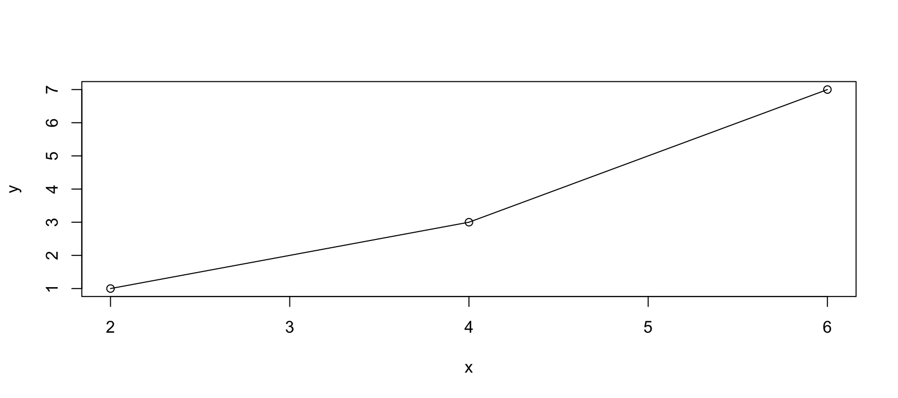
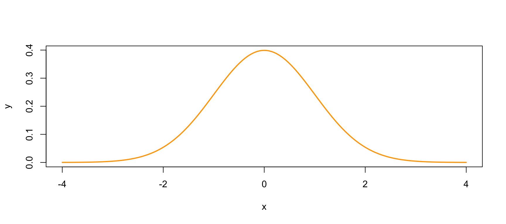

---
    output:
      html_document:
              
        toc: true
        toc_float: false
        toc_depth: 3
        number_sections: true
        
        code_folding: hide
        code_download: true
        
        fig_width: 9 
        fig_height: 4
        fig_align: "center"
        
        highlight: pygments
        theme: cerulean
        
        keep_md: true
    title: "Cats"
    subtitle: "All about cats"
    author: "SM"
---


```r
knitr::opts_chunk$set(
    echo = TRUE, # show all code
    tidy = FALSE, # cleaner code printing
    size = "small", # smaller code
    
    fig.path = "figures/", #graphics location
    out.width = "100%",

    message = FALSE,
    warning = FALSE
    )

#create a colour pallete for our analysis
col_1 <- "#00AFBB"
col_2 <- "#E69F00"
col_3 <- "blueviolet"
#colour-blind friendly red/green
col_red <- "#DC3220"
col_green <- "#40B0A6"
```


# cat

## happy cat {.tabset .tabset-fade .tabset-pills}

happy cats are happy.


```r
x <- c(2,4,6)
y <- c(1,3,7)
plot(y~x)
lines(x,y)
```



### green cat {-} 

green cats are green

### white cat {-}

white cats are white

### blue cat {-}

blue cats are blue

### red cat {-}

red cats are red

# cat

## hungry cat {-}

hungry cats are hungry.


```r
x <- seq(-4, 4, length.out = 100)

y <- dnorm(x)

plot(x, y, type = "l", lwd = 2, col = "orange")
```


